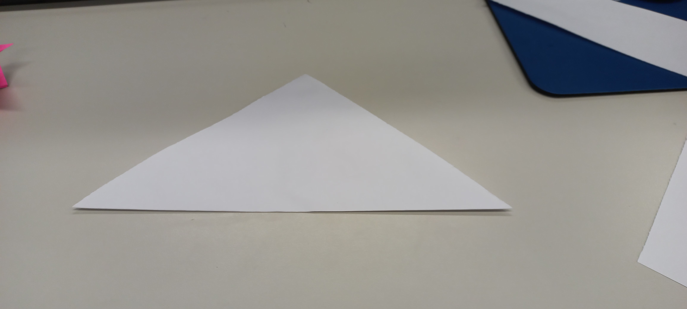
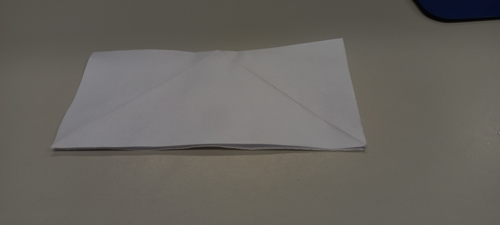
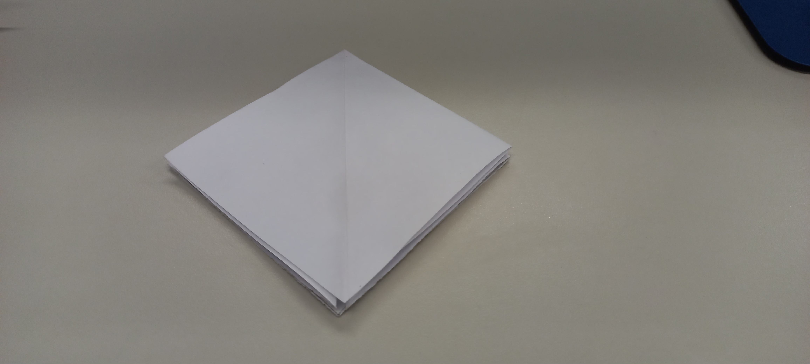
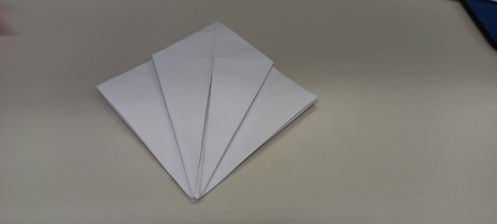
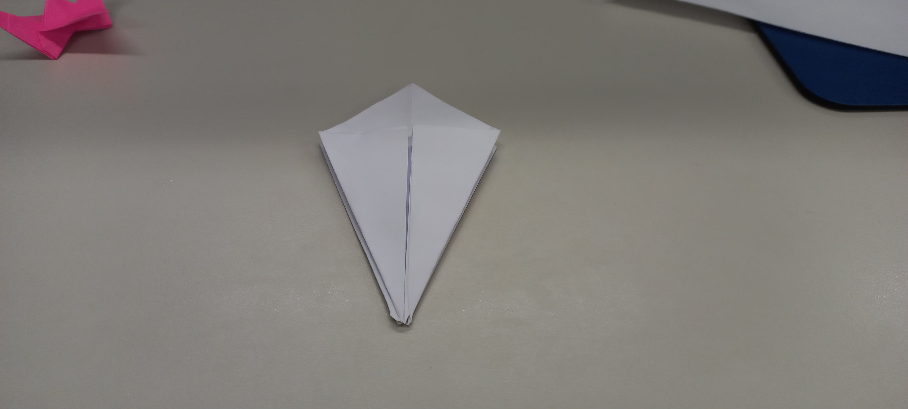
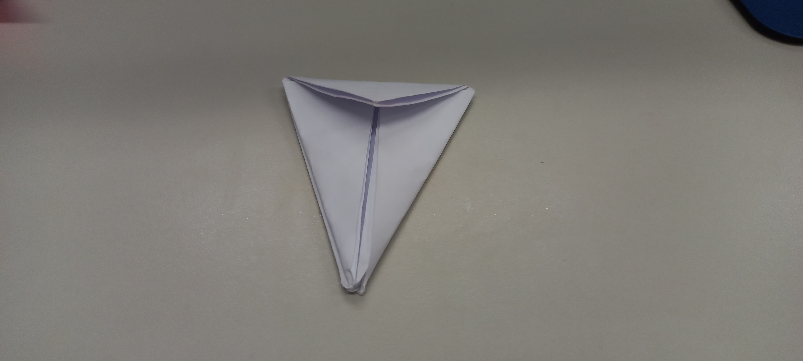
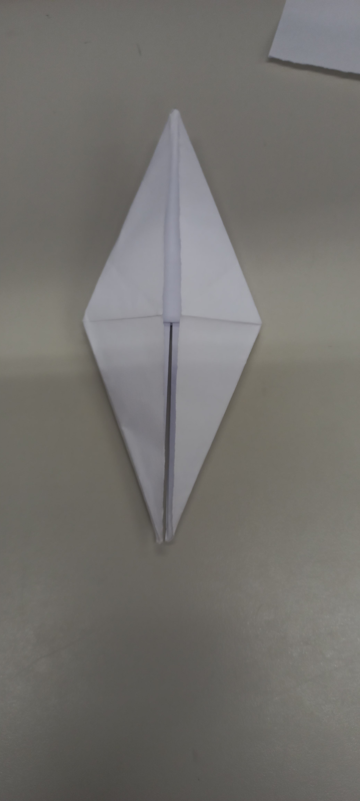
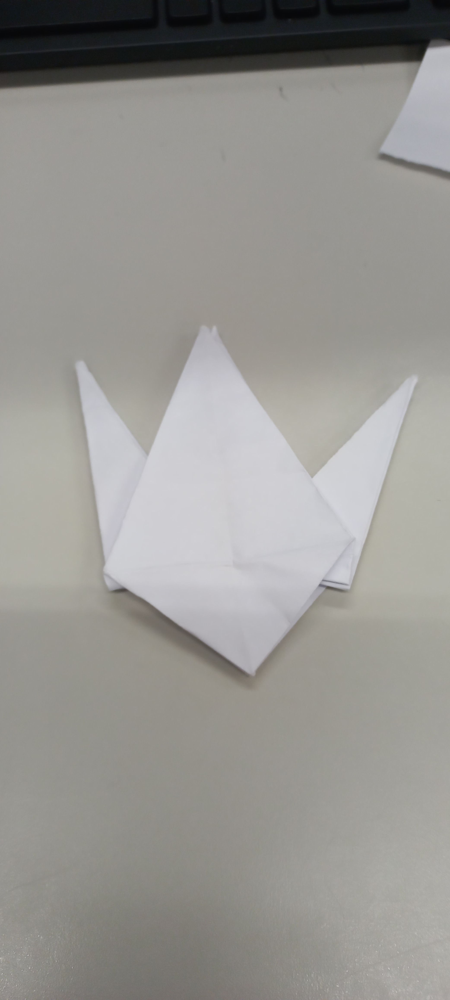
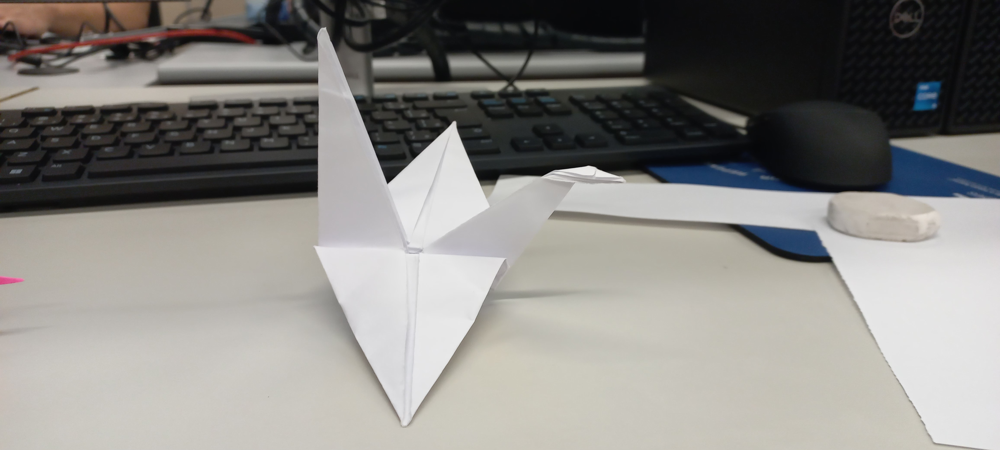

# Tsuru

**Materiais:**

* Um pedaço de papel quadrado (qualquer tamanho serve para começar, mas 15x15 cm é um bom tamanho para aprender).

**Passos:**

1.  **Comece com o lado colorido (se houver) virado para cima.** Dobre o papel ao meio na diagonal, formando um triângulo. Desdobre.

2.  **Dobre ao meio na outra diagonal**, formando outro triângulo. Desdobre. Agora você terá duas dobras diagonais cruzadas no papel.

3.  **Vire o papel para que o lado colorido fique para baixo.** Dobre o papel ao meio horizontalmente, formando um retângulo. Desdobre.

4.  **Dobre ao meio verticalmente**, formando outro retângulo. Desdobre. Agora você terá uma cruz de dobras no centro do papel.

5.  **Chegou a parte um pouco mais complexa:** Segure o papel com uma das mãos e, com a outra, junte as laterais do losango central que se formou pelas dobras. As dobras diagonais vão se encontrar, e as dobras horizontais e verticais vão se dobrar para dentro, formando um quadrado menor com uma aba dupla na parte inferior.

6.  **Posicione o quadrado com a abertura (as duas abas soltas) virada para baixo.**

7.  **Pegue a aba da frente e dobre a borda lateral direita em direção à linha central.** Faça o mesmo com a borda lateral esquerda. Você terá uma forma de pipa.

8.  **Vire o papel para o outro lado e repita o passo 7** com a aba de trás. Agora você terá um losango com uma linha vertical no meio, com duas "pernas" na parte inferior.

9.  **Dobre a ponta superior do losango para baixo**, alinhando-a com a base da forma de pipa que você criou nos passos 7 e 8. Desdobre. Essa dobra criará uma marca que você usará no próximo passo.

10. **Abra a aba da frente (uma das "pernas") e levante a borda inferior até a marca que você acabou de fazer.** Ao mesmo tempo, abra as laterais da aba e achate-a, dobrando ao longo das linhas que você já criou. Isso formará um losango fino.

11. **Vire o papel e repita o passo 10** com a aba de trás. Agora você terá uma forma com um losango fino de cada lado e duas pontas na parte superior.

12. **Pegue uma das pontas superiores e dobre-a para baixo**, ao longo da linha central, formando o que será o pescoço ou a cauda do tsuru. Dobre bem.

13. **Vire o papel e repita o passo 12** com a outra ponta superior.

14. **Agora, você tem duas pontas alongadas (pescoço e cauda). Escolha uma delas para ser a cabeça.** Dobre a ponta para dentro, formando um pequeno ângulo, para criar o bico do tsuru.

15. **Abra delicadamente as "asas" do tsuru**, puxando as laterais do corpo para fora.

16. **Modele as asas com cuidado**, dobrando-as levemente para cima ou para baixo, para dar um formato mais realista ao seu tsuru.

